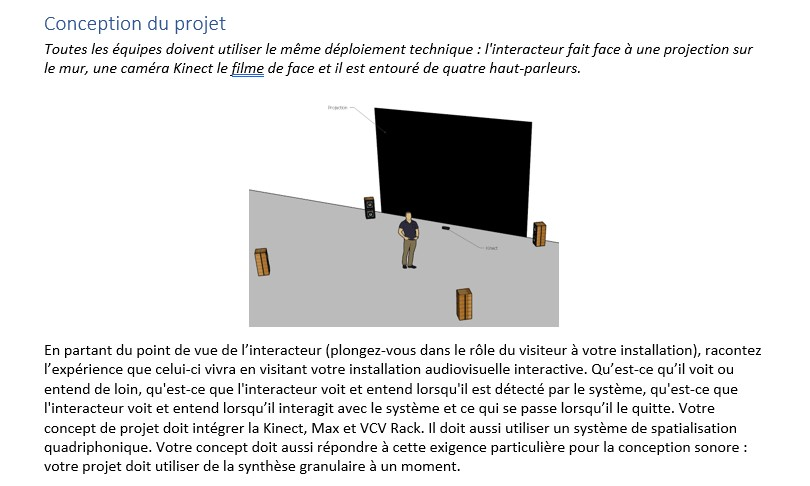
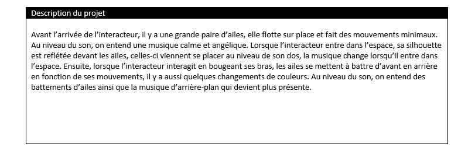
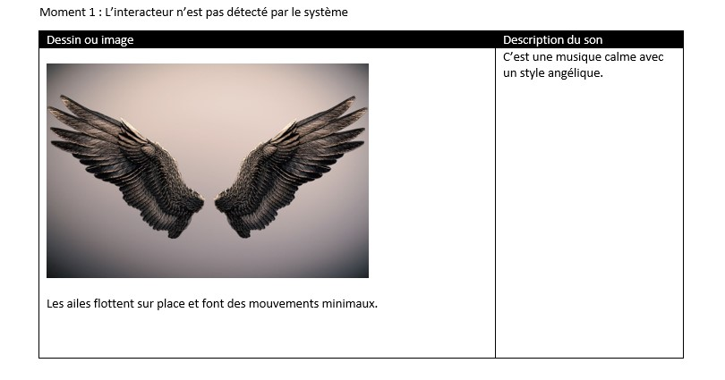
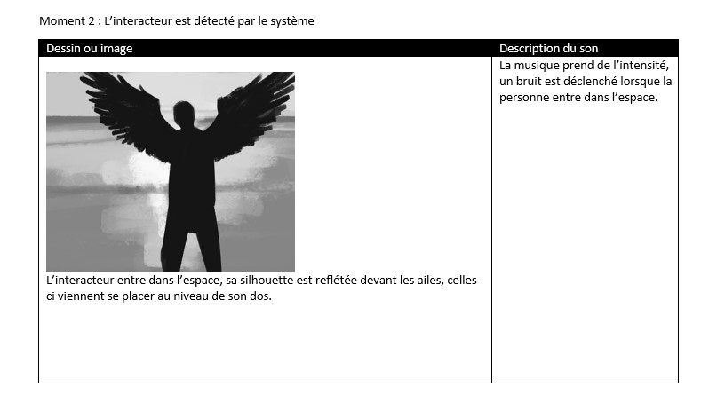
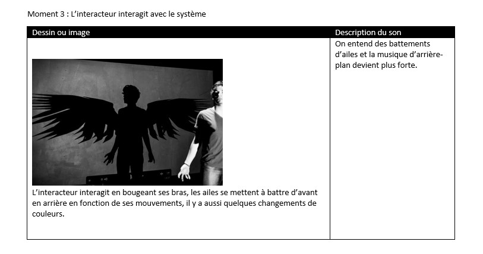

Envol est un projet d'installation interactive audiovisuelle réalisé en équipe. Lorsque l'interacteur est détecté par la kinect, son image est projeté à l'écran avec une animation d'ailes en arrière. Le mouvement de bras de l'interacteur fait réagir les ailes en question.

- Réalisatrices: Marie Tracy Naomie Gua, Maria Laura Coronel Petit, Florence Lapierre

Logiciels utilisés: Max Cycling '74, VCV Rack

# Processus

## Scénarimage

