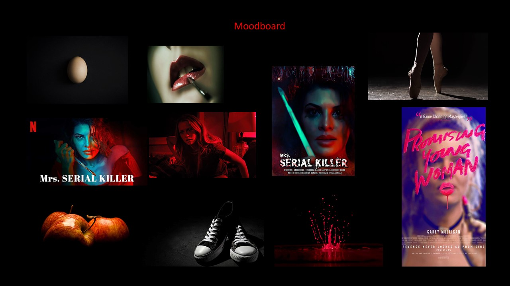
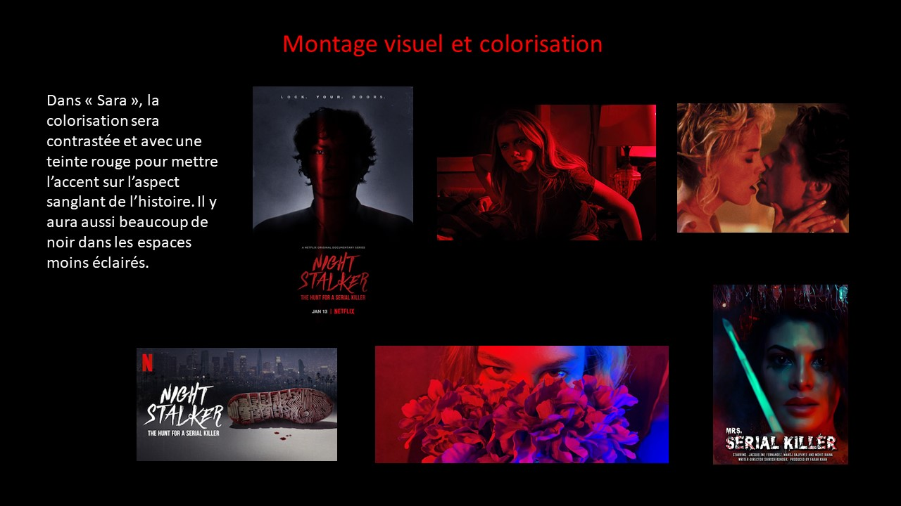
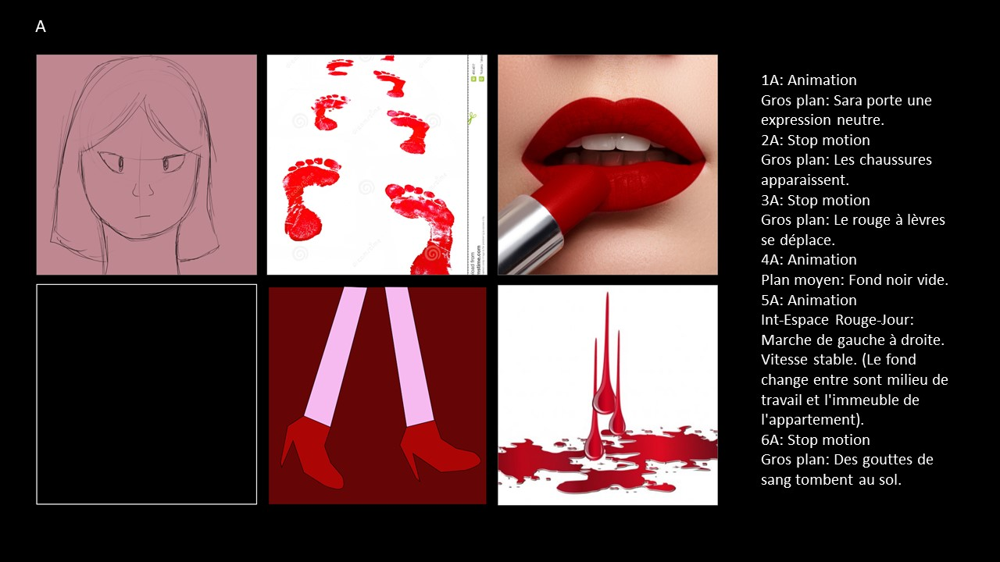
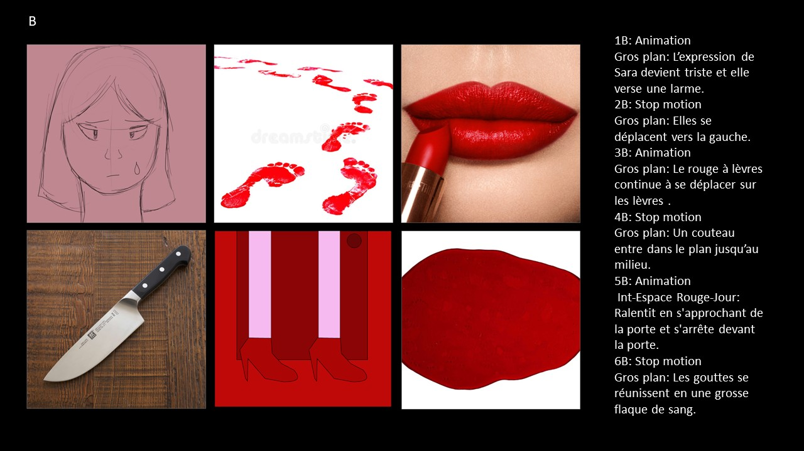
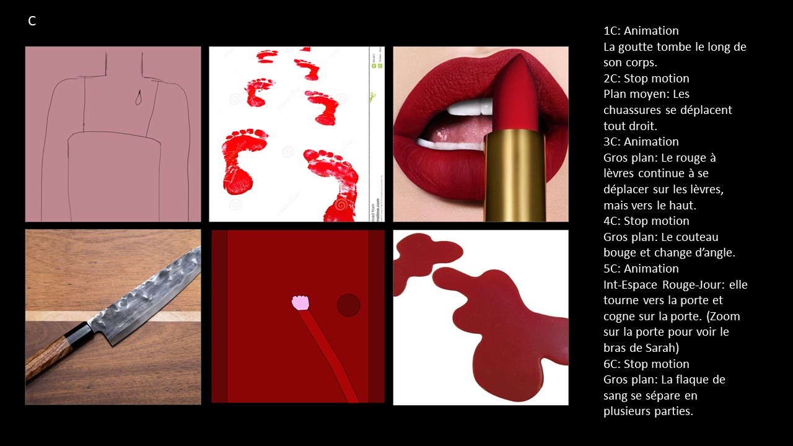
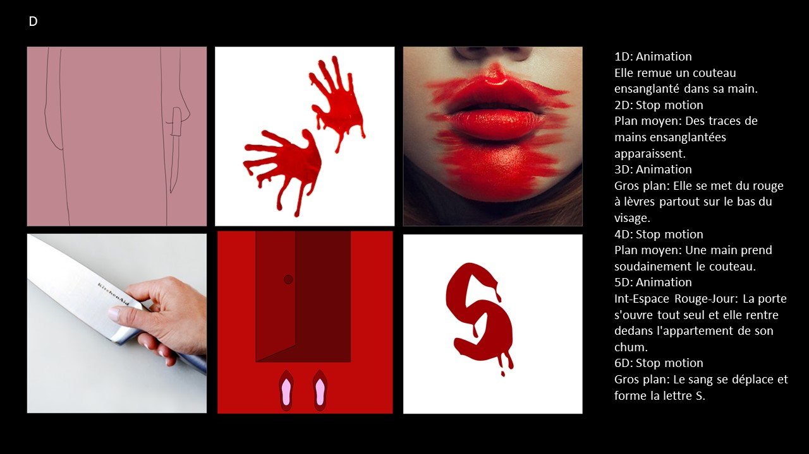
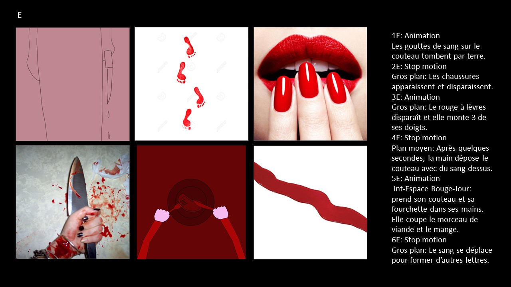
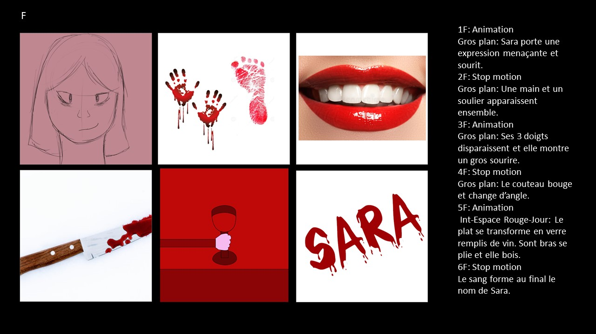

- Réalisatrices: Marie Tracy Naomie Gua, Maria Laura Coronel Petit, Natacha Abdallah
- Directrice Artistique: Marie Tracy Naomie Gua
- Assistant Artistique: Natacha Abdallah
- Scénarisation: Marie Tracy Naomie Gua, Maria Laura Coronel Petit, Natacha Abdallah
- Équipe de tournage: Marie Tracy Naomie Gua, Maria Laura Coronel Petit, Natacha Abdallah
- Montage vidéo et colorisation: Marie Tracy Naomie Gua, Maria Laura Coronel Petit, Natacha Abdallah
- Actrice: Maria Laura Coronel Petit
- Éclairage: Marie Tracy Naomie Gua, Natacha Abdallah
- Animation 2D: Marie Tracy Naomie Gua, Maria Laura Coronel Petit, Natacha Abdallah
- Montage sonore: Marie Tracy Naomie Gua
- Générique: Marie Tracy Naomie Gua

Logiciels utilisés: After Effects, Illustrator, Photoshop, Davinci Resolve, Photoshop

# Processus

## Scénarimage

